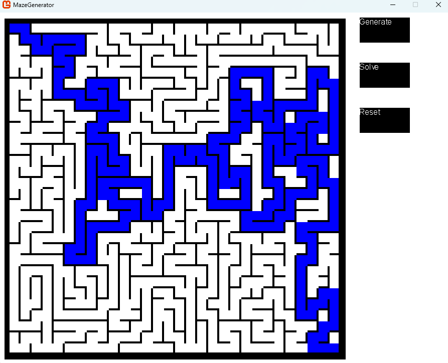

2023.11.15:  
Generating and solving algorithm chooser added to the gui. New generating algorithm implemented.  
Some refactoring.  
  

2023.11.14:  
Basic Gui elements added for easy controlls. Codebase greatly refactored for future expansions.  
  

2023.11.11:  
Maze generator and solver program made with c# and monogame.  
The program uses the Iterative implementation (with stack) of the Randomized depth-first search algorithm to ganerate, and uses the Trémaux's algorithm to solve the maze.  
   
